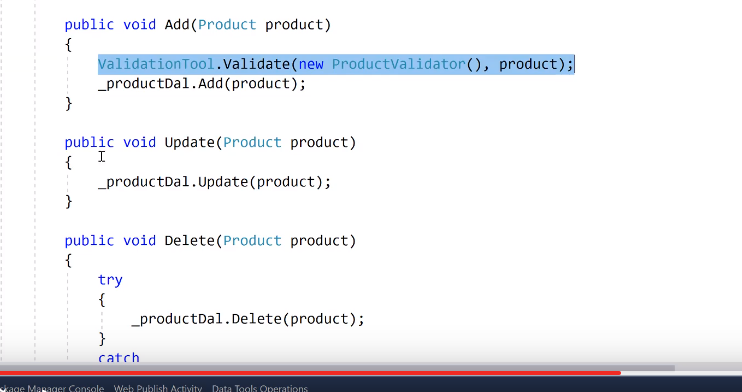
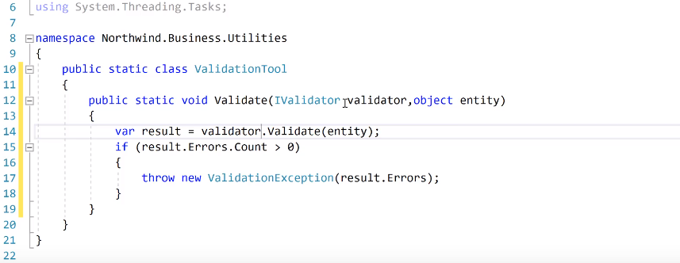

# Validator

ValiditionRules klasörünün içerisine

FluentValidation klasörü açılır ve içerisine bir class türetilir.

ProductValidator->Class

AbstractValidator dan inherit edilmesi gerekir. Of\<Product>

Constractur oluşturulur ve içerisine

RuleFor(p=>p.ProductName).NotEmpty();

RuleFor(p=>p.CategoryId).NotEmpty();

RuleFor(p=>p.UnitPrice).NotEmpty();

RuleFor(p=>p.QuantityPerUnit).NotEmpty();

RuleFor(p=>p.UnitPrice).GreaterThan(0); -< sıfırdan büyük olmalı

RuleFor(p=>p.UnitPrice).GreaterThan(10).When(p=>p.CategoryId ==2);

