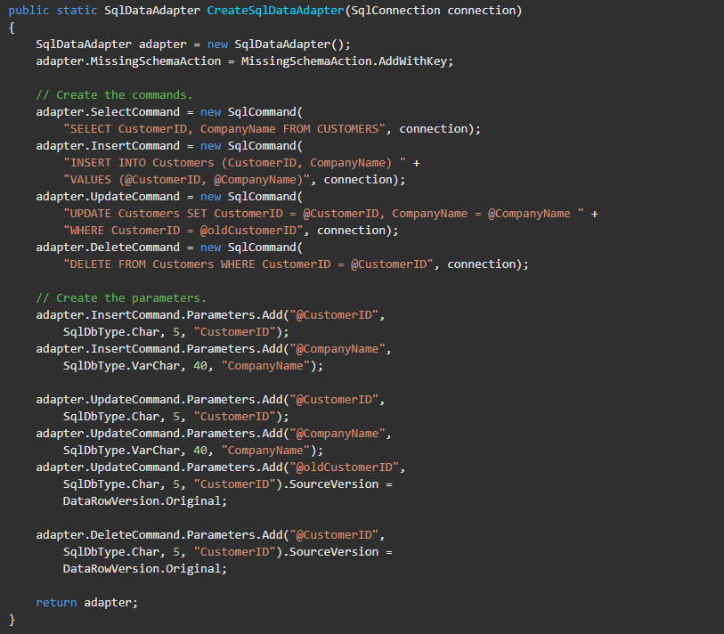

# Karışık





## Primitive Type Kavramı Hakkında

Primitive terimine denk düşecek Türkçe bir kavram aradıysam da en yakın birebir anlamı olan _ilkel_ sözcüğü terim anlamını pek karşılamadığı için sözlükteki _primitif_ sözcüğünü kullanmayı seçtim. Yazıda bu şekilde devam edeceğimi belirterek kavrama hemen geçiyorum.

En genel anlamda primitif türler dilin en temel türlerini oluşturmaktadır ve derleyici seviyesinde bilinmektedirler. Diğer tüm türlerin bunları kullanarak oluşturulduğunu söylersek yanlış olmaz. Primitiflik C# için değil onun çalıştığı .net platformu için vardır. Biliyorsunuz ki .net kullanılarak yazılmış projeler geliştirildikleri dil her ne olursa olsun sonuçta bir MSIL koduna dönüşeceklerdir.

Primitif türler ile _built-in_ (gömülü) türleri ve Visual Basic .net'in kendi primitif tür tanımlarını karıştırmamak gerekmektedir. Burada en temel fark biraz önce söylediğim gibi sanki atomu oluşturan parçalarmış gibi bu türün bölünemez olmasıdır. Örneğin, _string_ türü gömülü bir tür olsa da hepinizin bildiği gibi aslında _char_ türünden _immutable_ (değişmez) bir dizidir. Dolayısıyla alt parçalarına ayrılabilir. Yine _decimal_ basit görünen bir tip olsa da aslında arkada _int_ türünden değerler kullanan bir _struct_ (yapı) dır ve aslında yine C# kullanılarak yazılmıştır. Primitif olan ve olmayan tiplere ait kaynak kodları ([DateTime](http://referencesource.microsoft.com/#mscorlib/system/int16.cs) [Decimal](http://referencesource.microsoft.com/#mscorlib/system/decimal.cs) [Short](http://referencesource.microsoft.com/#mscorlib/system/datetime.cs)) incelerseniz primitif tiplerin kendilerini bellekte saklayan kısımların kendi alias tiplerinde (_Int32_ için int, Int16 için short...); primitif olmayanlarda ise örneğin _decimal_ da primitif tipler ile olduğunu göreceksiniz. Yani aslında _Int32_ ile _int_ arasında kendisini derleme açısından bir fark vardır. Aksi durumda .net'in kendi kodlarının kendisini derlenmesi mümkün olmayacaktır (_bir struct tanımlarken struct'ın fieldlarından herhangi biri structın kendisi ile aynı türden olamaz_). Ama tabii ki bizim kullanımımız açısından _int_ ya da _Int32_ neredeyse hiç bir fark (_using System; yazma şartı dışında_) yok.

Bir türün primitif olup olmadığını anlamak için `[Tür].IsPrimitive` şeklinde sormamız yeterlidir.

```csharp
Console.WriteLine(typeof(int).IsPrimitive);
Console.WriteLine(typeof(Int32).IsPrimitive); // aslında üsteki ile aynı
Console.WriteLine(typeof(decimal).IsPrimitive);
Console.WriteLine(typeof(string).IsPrimitive);
Console.WriteLine(typeof(DateTime).IsPrimitive);
Console.WriteLine(typeof(short).IsPrimitive);

/*Sonuçlar

True
True
False
False
False
True

*/COPY
```

Farklı bir framework kullanmadığınız sürece primitif türler `Boolean, Byte, SByte, Int16, UInt16, Int32, UInt32, Int64, UInt64, IntPtr, UIntPtr, Char, Double, Single` şeklindedir. Anlaşıldığı üzere kendi derleyicinizi yazmadığınız sürece kendi primitif türünüzü oluşturmanız pek olası değil.

Peki hangi türlerin primitif olduğunu bilmenin ne gibi kazancı olur? Öncelikli fayda performans olacaktır çünkü olası en yalın türler ile çalışıyor olacaksınız. Örneğin, bu sebeple eğer yaklaşık değer size yeterli oluyorsa _double_ kullanmak _decimal_ kullanmaktan performanslı olacaktır -_ki oyun geliştirirken bu bilgi oldukça işe yaramaktadır_. Bunun dışında eğer [marshalling](https://msdn.microsoft.com/en-us/library/0t2cwe11\(v=vs.80\).aspx)(_elinizdeki .net verisinin başka platformlara bellek üzerinden aktarmanız için yaptığınız serileştirme işleri_) gibi konularla ilgileniyorsanız primitif tiplerde görünen tür farklı olacaktır.
